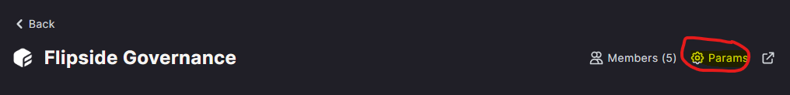

# Solana Fact Proposal Votes Realms

`solana.fact_proposal_votes_realms`

This table is in development and will be available in Velocity shortly. \
\
Realms is a governance platform on Solana that allows for the easy creation of a gated voting space and allows for proposal creation and voting. More can be found on Realms on their [webpage](https://app.realms.today/realms).

The Realms ID and program ID can be found on Realms by clicking on a space, and then clicking on the params button on the far left side of the header. To find the proposal address, click on a proposal and look at the address that appears in the URL. Vote options are sourced from the transaction logs in the [solana.fact\_transactions](solana-fact-transactions-table.md) table. \
\

| Field            | Type      | Description                                                                                                                        |
| ---------------- | --------- | ---------------------------------------------------------------------------------------------------------------------------------- |
| block\_timestamp | timestamp | The time the block began.                                                                                                          |
| block\_id        | integer   | Unique sequential number that identifies the current block.                                                                        |
| tx\_id           | string    | A unique key that identifies a transaction.                                                                                        |
| succeeded        | boolean   | A boolean that tells if a transaction successfully occurred or failed.                                                             |
| index            | integer   | Location of the event within the instructions of a transaction.                                                                    |
| program\_id      | string    | A program ID belonging to a space. The default program\_id is "GovER...", but will vary if a space uses their own smart contract.  |
| realms\_id       | string    | An address unique to each space on Realms. A space can be a voting group, DAO, organization, etc.                                  |
| proposal         | string    | An address unique to each proposal on Realms.                                                                                      |
| voter            | string    | The wallet address of the user voting on the proposal.                                                                             |
| vote\_account    | string    | An account automatically generated when a user casts a vote. This account is owned by the voter.                                   |
| vote\_choice     | string    | How the user voted. Either YES, NO, or ABSTAIN. Ranked votes are always YES, followed by a non-zero vote\_rank.                    |
| vote\_rank       | integer   | In a ranked vote, this will be the order of preference. Otherwise 0.                                                               |
| vote\_weight     | integer   | The percentage of voting power put towards the vote option.                                                                        |
