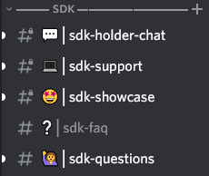

# 🍄 Get Started

Programmatic access to the most comprehensive blockchain data in crypto for analysts, developers, and data scientists.

### 1. Get your API key

Go to [https://sdk.flipsidecrypto.xyz ](https://sdk.flipsidecrypto.xyz)to mint your **free** ShroomDK NFT. After minting, your API Key will be revealed and can be plugged into the SDKs / API.

### 2. Choose your stack

#### SDKs

| Language        | Version | Status                                                                                |
| --------------- | ------- | ------------------------------------------------------------------------------------- |
| ✅ JS/TypeScript | 1.1.0   |      |
| ✅ Python        | 1.0.1   |  |
| ✅ R             | 1.0.0   |                                                                                       |

Want a different SDK? Please let us know in [Discord](https://discord.gg/ZmU3jQuu6W). Want to create your own SDK, we'd be happy to showcase it here.

**REST API**

You can also query data with our  [REST API](rest-api.md) directly.

### 3. Get inspired

Explore our data in the [Flipside app](https://app.flipsidecrypto.com/), check out SDK [code examples](examples.md), and see what people in the community are [creating](community-showcase.md).

### 4. Connect & create

Introduce yourself :wave: in the SDK [Discord](https://discord.gg/ZmU3jQuu6W) channels, ask questions and share what you're working on.

<figure><figcaption></figcaption></figure>

### 5. Share

Tag [@flipsidecrypto](https://twitter.com/flipsidecrypto/), share in [Discord](https://discord.gg/ZmU3jQuu6W), and add your work to our [Community Showcase](community-showcase.md) —  apps, data science, advanced analytics — the crypto space wants to see what you're creating.
