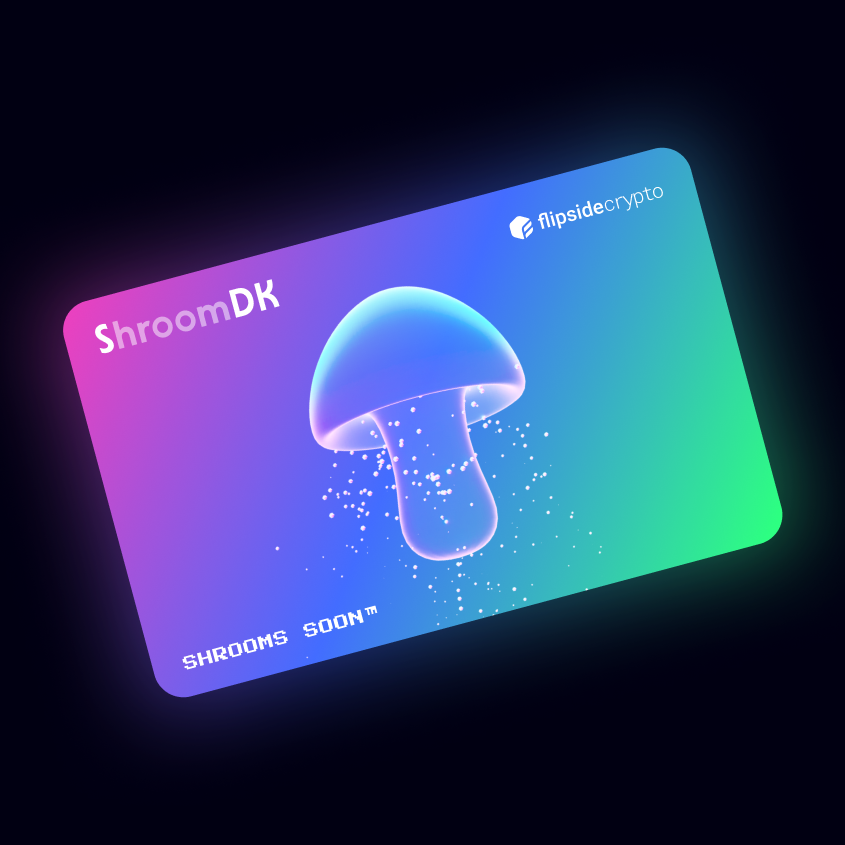

# 🍄 Getting Started

Welcome, Fren! You've found yourself at the Flipside Crypto SDK documentation. To get started you need a ShroomDK NFT. The NFT serves as an API Key generator. Your API Key can be utilized  with our language-specific SDKs or directly with the RestAPI.

### Mint a ShroomDK NFT to Generate Your API Key

Go to [https://sdk.flipsidecrypto.xyz ](https://sdk.flipsidecrypto.xyz)to mint your free ShroomDK NFT. Every day a random number of NFTs are made available to mint, for free. After minting, your API Key will be revealed and can be plugged into the SDKs / API.

### What if all ShroomDK NFTs are minted out for the day?

If we're all minted out for the day you have a few options:

1. :envelope:Grab an invite code from a fren
2. :moneybag:Purchase an NFT on OpenSea
3. :date:Try again tomorrow

Have more questions? Check out the FAQ at [https://sdk.flipsidecrypto.xyz](https://sdk.flipsidecrypto.xyz)

###
